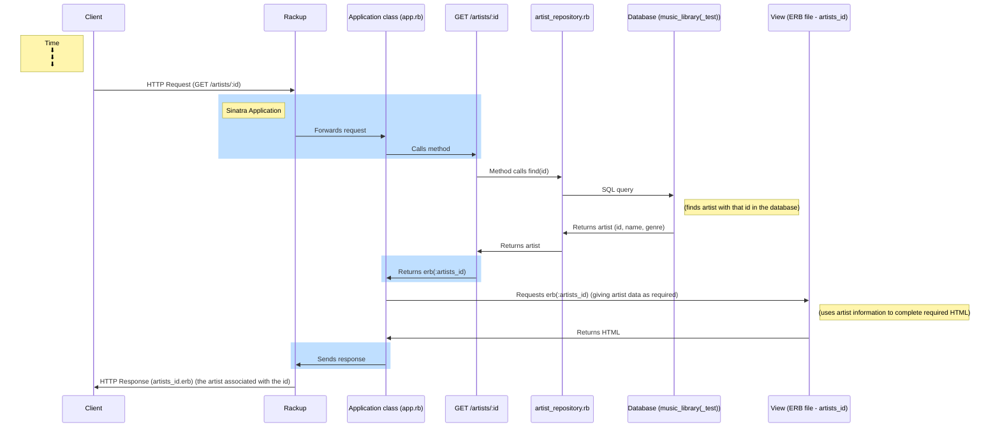

```mermaid
sequenceDiagram
    participant c as Client
    participant rack as Rackup
    participant app as Application class (app.rb)
    participant g_block as GET /artists/:id
    participant ar as artist_repository.rb
    participant db as Database (music_library(_test))
    participant v as View (ERB file - artists_id)

    Note left of c: Time <br />⬇ <br /> ⬇ <br /> ⬇

    c->>rack: HTTP Request (GET /artists/:id)

    rect rgb(191, 223, 255)
    Note left of rack: Sinatra Application
    rack->>app: Forwards request
    app->>g_block: Calls method
    end
    g_block->>ar: Method calls find(id)
    ar->>db: SQL query
    Note right of db: (finds artist with that id in the database)
    db->>ar: Returns artist (id, name, genre)
    ar->>g_block: Returns artist
    rect rgb(191, 223, 255)
    g_block->>app: Returns erb(:artists_id)
    end
    app->>v: Requests erb(:artists_id) (giving artist data as required)
    Note right of v: (uses artist information to complete required HTML)
    v->>app: Returns HTML
    rect rgb(191, 223, 255)
    app->>rack: Sends response
    end

    rack->>c: HTTP Response (artists_id.erb) (the artist associated with the id)

```
