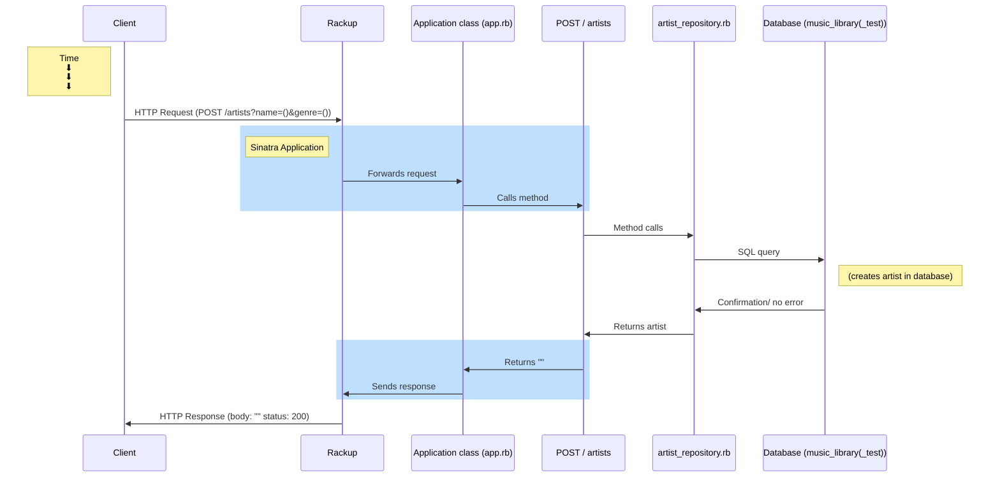

Create a sequence diagram explaining the behaviour of your program when a request is sent to GET /artists/:id. Make sure your diagram all includes the following:
The HTTP Client
The HTTP Request and the data it contains
The HTTP Response and the data it contains
The Application class (app.rb)
The Repository class (artist_repository.rb)
The View (ERB file)
The Database

