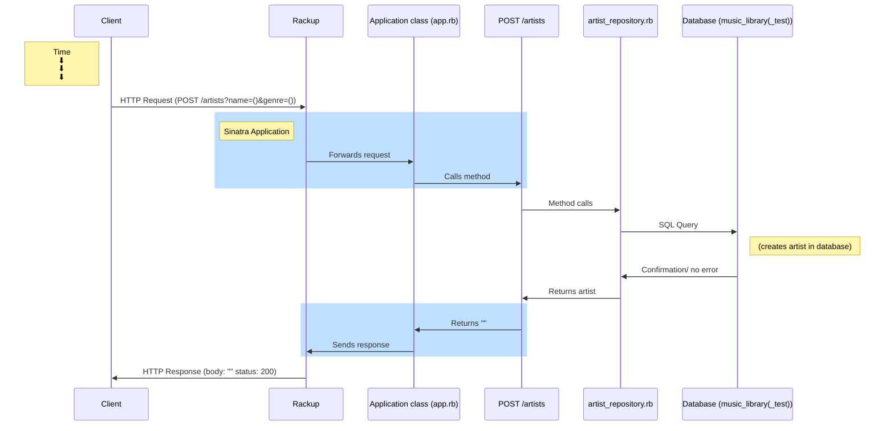

# POST/artists Sequence Diagram

```mermaid
sequenceDiagram
    participant c as Client
    participant rack as Rackup
    participant app as Application class (app.rb)
    participant p_block as POST /artists
    participant ar as artist_repository.rb
    participant db as Database (music_library(_test))

    Note left of c: Time <br />⬇ <br /> ⬇ <br /> ⬇

    c->>rack: HTTP Request (POST /artists?name=()&genre=())

    rect rgb(191, 223, 255)
    Note left of rack: Sinatra Application
    rack->>app: Forwards request
    app->>p_block: Calls method
    end
    p_block->>ar: Method calls
    ar->>db: SQL Query
    Note right of db: (creates artist in database)
    db->>ar: Confirmation/ no error
    ar->>p_block: Returns artist
    rect rgb(191, 223, 255)
    p_block->>app: Returns ""
    app->>rack: Sends response
    end

    rack->>c: HTTP Response (body: "" status: 200)

```

