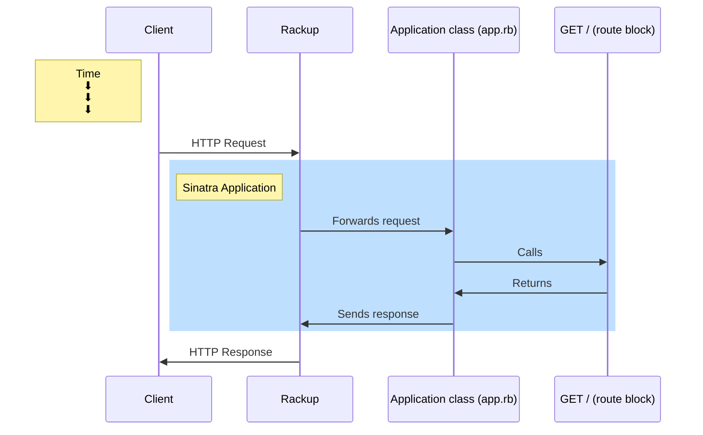

# POST/artists Sequence Diagram

(The HTTP Client
The HTTP Request and the data it contains
The HTTP Response and the data it contains
The Application class (app.rb)
The Repository class (artist_repository.rb)
The Database)

